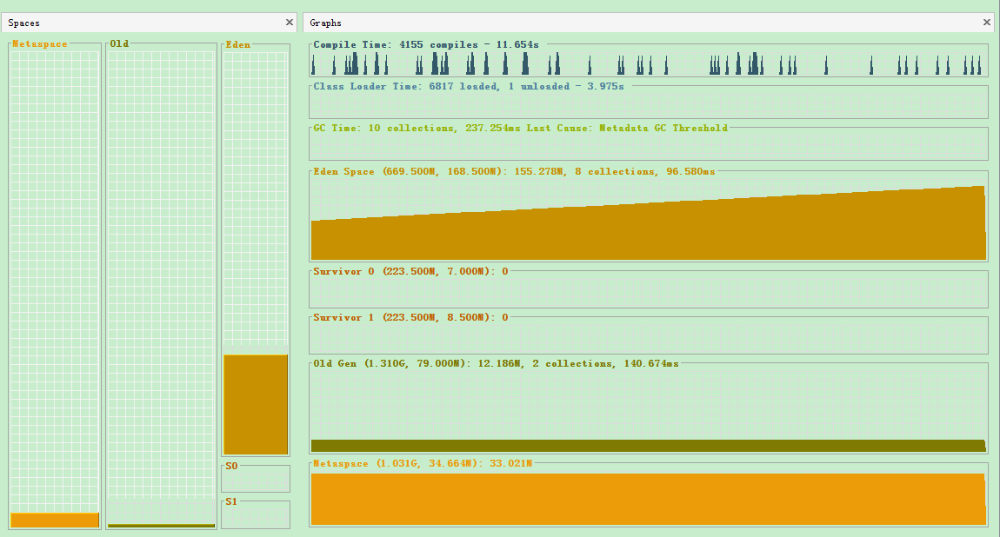

# Spaces Window
- Spaces 分为：元空间、 老年代、 新生代

```
在 JDK8 版本中，JVM 不再有 PermGen 。但类的元数据信息（metadata）还在，只不过不再是存储在连续的堆空间上，而是移动到 Metaspace 的本地内存（Native memory）中。
```

- 新生代分为 3 个部分： Eden、 S0（Survivor 0）、 S1（Survivor 0）

```
每个方框中都使用不同的颜色标识，其中有颜色的区域是占用的空间，空白的部分是指剩余的空间
```

# Graphs Window
## Compile Time
编译时间表示虚拟机 JIT 编译器编译代码所花费的时间

## Class Loader Time
表示 class 的 load 和 unload 时间

## GC Time
- 10 collections：表示自监视以来一共经历了 10 次 GC, 包括 Minor GC 和 Full GC

- 237.254ms：表示 GC 共花费了 237.254ms

- Last Cause：表示上次发生 GC 的原因

## Eden Space
- Eden Space (669.500M，168.500M): 155.278M

表示 Eden Space 最大可分配空间是 669.500M，当前分配空间 168.500M，当前占用空间 155.278M

- 8 collections， 96.580ms：表示当前新生代发生 GC 的次数为 8 次, 共占用时间 96.580ms

## Survivor 0
Survivor 0 (223.500M, 7.000M): 0

表示 S0 最大分配空间 223.500M，当前分配空间 7.000M，已占用空间 0

## Survivor 1
Survivor 1 (223.500M, 8.500M): 0

表示 S1 最大分配空间 223.500M，当前分配空间 8.500M，已占用空间 0

```
S0 和 S1 肯定有一个是空闲的，这样才能方便执行 minor GC 的操作，但是两者的最大分配空间是相同的，并且在 minor GC 时，会发生 S0 和S1 之间的切换。
```

## Old Gen
- (1.310G, 79.000M) : 12.186M

表示 OldGen 最大分配空间 1.310G， 当前空间  79.000M， 已占用空间 12.186M

- 2 collections, 140.674ms

表示老年代共发生了 2次 GC， 共耗时 140.674m

```
老年代 GC 也叫做 Full GC， 因为在老年代 GC 时总是会伴随着 Minor GC， 合起来就称为 Full GC。
```

## Metaspace

(1.031G, 34.664M): 33.021M

表示 Metaspace 最大可分配空间是 1.031G，当前分配空间 34.664M，当前占用空间 33.021M
